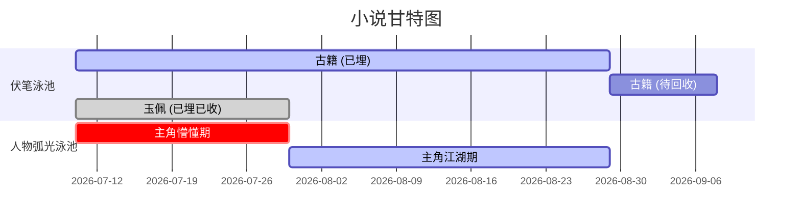

# gantt-audit.md — 甘特图 6+ 泳池巡检子系统

> **决策依据**：P11（35 题压力测试锁定）
> **重要性**：🔴 **关键**（每 10 章一次巡检；MVP 必做的核心命令之一）
> **状态**：📋 设计阶段
> **关联**：router.md / facts-extraction（依赖）/ multi-agent-cloud.md

---

## 🎯 系统职责

每 10 章一次，对最近 10 章进行**6+ 泳池并行巡检**，输出甘特图报告。

### 核心思想（用户原话）

> "按照甘特图，其实每一个泳池里都有要巡检的内容"
> "不单单是伏笔，按照甘特图，其实每一个泳池里都有要巡检的内容"

甘特图 = 多泳道并行，**不是单次深度审计**。

---

## 📊 甘特图泳池定义（MVP 6 + Phase 2 增加 2+）

### MVP 必做 6 个泳池

| # | 泳池名称 | 巡检内容 | 数据来源 |
|---|---------|---------|---------|
| 1 | **伏笔泳池** | 已埋 / 待收 / 已收三态 | `05-foreshadow.md` + `chapters/*.md` |
| 2 | **人物弧光泳池** | 主角 / 主要配角 / 反派的成长变化 | `02-characters.md` + 章节事实 |
| 3 | **物品升级泳池** | 金手指 / 关键道具 / 装备的持有与升级 | `04-special-setting.md` + 章节事实 |
| 4 | **世界观规则泳池** | 新挖的坑 / 新立的法 / 边界 | `01-world.md` + 章节事实 |
| 5 | **看点泳池** | 高光点 / 爽点 / 虐点 / 钩子密度 | 章节事实（情绪曲线） |
| 6 | **关系演变泳池** | 人物关系变化（亲近 / 敌对 / 中立） | `02-characters.md` + 章节事实 |

### Phase 2 增加 2 个

| # | 泳池名称 | 巡检内容 |
|---|---------|---------|
| 7 | **线索网泳池** | 悬疑 / 探案类作品的真相拼图进度 |
| 8 | **哲学主题泳池** | 主题发展 / 意象演变 |

题材模板可以加更多：玄幻可加"修炼体系泳池"、言情可加"情感弧光泳池"。

---

## 📐 甘特图的数据结构

每个泳池 = 一维时间轴：

```yaml
swimlanes:
  - name: 伏笔泳池
    items:
      - id: foreshadow_001
        chapter_buried: 5
        chapter_due: 50
        chapter_resolved: null   # 未回收
        title: "古籍"
        severity: high           # 主线伏笔
      - id: foreshadow_002
        chapter_buried: 12
        chapter_due: 30
        chapter_resolved: 30
        title: "玉佩"
        severity: low
      # ...

  - name: 人物弧光泳池
    items:
      - id: arc_protagonist
        character: 主角
        segments:
          - chapter_start: 1
            state: "懵懂少年"
          - chapter_start: 20
            state: "初入江湖"
          - chapter_start: 50
            state: "侠之大者"
```

### 时间轴渲染（MVP 用 Mermaid 文本输出）



Phase 4 再做可视化。

---

## 🚦 巡检流程

### Phase 1：触发

- 每 10 章结束 → 系统自动检测 → 自动触发 `cumulative_audit`
- 作者也可手动触发
- 增量触发：作者修改设定后 → 自动只巡检受影响泳池

### Phase 2：泳池并行处理

- 6 个泳池**本地 Ollama 并行处理**（Q31 单 Agent 多 persona + 同时启动）
- 每个泳池分配 token 预算 4k
- 每个泳池输出独立报告

### Phase 3：汇总

- 合并 6 份泳池报告
- 按严重度排序
- 输出统一 `audit_report_<chapter_range>.md`

### Phase 4：甘特图渲染

- MVP 输出 Mermaid 文本（甘特图）
- Phase 4 可视化（HTML / Web）

### Phase 5：决策

- 作者决定哪些问题修复
- git diff 自动触发联动（R3）

---

## 📋 每个泳池的检查清单

### 1. 伏笔泳池（F3 半自动闭环）

- [ ] 所有未回收伏笔是否接近回收章
- [ ] 是否有过期伏笔（已超过 due 章）
- [ ] 是否伏笔密度过高（每章埋太多）
- [ ] 是否同章埋多个主线伏笔（避免回收风险）

### 2. 人物弧光泳池

- [ ] 主角弧光是否有清晰阶段（懵懂 → 觉醒 → 成熟）
- [ ] 反派动机是否到中段揭示
- [ ] 配角弧光是否被遗忘
- [ ] 是否有"突然 OOC"（性格反转无铺垫）

### 3. 物品升级泳池

- [ ] 金手指是否按规划升级
- [ ] 关键道具是否被遗忘
- [ ] 物品限制是否被违反

### 4. 世界观规则泳池

- [ ] 新挖的坑是否被填
- [ ] 新立的法是否被引用
- [ ] 边界是否被违反

### 5. 看点泳池

- [ ] 最近 10 章是否有 3+ 爽点
- [ ] 高潮分布是否均匀
- [ ] 钩子密度（章末悬念是否充足）
- [ ] 是否过于平淡（连续多章无看点）

### 6. 关系演变泳池

- [ ] 主角与反派的敌对是否被加强
- [ ] 主角与盟友的友谊是否被加深
- [ ] 中立角色是否出现站队
- [ ] 关系是否僵硬（无变化的）

---

## 📝 报告格式

`books/<name>/audit_report_<ch_start>-<ch_end>.md`：

```markdown
# 跨章审核报告（章节 X - Y）

## 一、整体统计
- 巡检章节：第 X 章 - 第 Y 章（共 N 章）
- 巡检泳池：6 个
- 已发现问题：M 个

## 二、各泳池报告

### 泳池 1：伏笔泳池（巡检 N 项）
✅ 通过
⚠️ 待改进：XX
❌ 必须修复：XX
```

---

## 🧪 测试用例

1. **空白书巡检**：所有泳池空，应报"无内容"
2. **完整 30 章巡检**：所有泳池应有数据
3. **过期伏笔**：埋了 50 章未收，应挑出
4. **人物弧光缺失**：主角 50 章仍"懵懂"，应挑出
5. **OOC**：第 25 章主角突然冷酷，触发警告
6. **世界观违规**：本不应该飞的角色飞了，应挑出

---

## 🔗 关联

- `router.md` §二 —— 任务类型 "甘特图泳池巡检" 路由规则
- `multi-agent-cloud.md` —— 多 Agent 输出合并
- `MVP_AUTHORITY.md` §四 Phase 1.C —— 甘特图在 MVP 启动顺序中

---

## 📌 元信息

- **创建者**：Claude（grill-me skill 驱动后）
- **重要性**：🔴 关键
- **关联决策**：P11 / F7 / Q20.2 / Q21 / Q33
